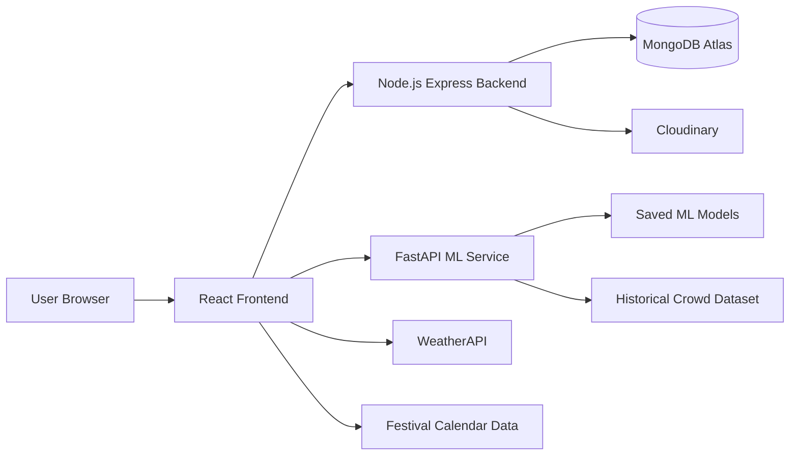

# SurakshaDarshan - Temple Crowd Management System

SurakshaDarshan is a full-stack temple crowd management platform built for online darshan planning. Users can search temples, view predicted crowd levels, reserve darshan slots, manage bookings, and generate QR-based booking passes. The project also includes a FastAPI-based ML service for visitor prediction using weather, festival, date, and historical crowd data.

## Live Links

- Website: [https://suraksha-darshan.onrender.com](https://suraksha-darshan.onrender.com)
- ML API Health Check: [https://suraksha-darshan-ml.onrender.com/health](https://suraksha-darshan-ml.onrender.com/health)
- GitHub Repository: [https://github.com/karankumarkhadria/SurakshaDarshan-](https://github.com/karankumarkhadria/SurakshaDarshan-)

## Features

- Temple search with state and district filters.
- Temple detail pages with location, images, tags, history, and crowd status.
- AI-based visitor prediction using weather, festival, date, weekend, and historical data.
- Darshan slot booking with 15 daily time slots per temple.
- Live seat availability with booked-seat and available-seat updates.
- Booking creation and cancellation with MongoDB transaction handling.
- User authentication using JWT and bcrypt.
- Group booking with visitor details, Aadhaar validation, and visitor categories.
- QR-based booking pass generation with download and print options.
- Booking history for current, previous, and cancelled bookings.
- Parking availability flow with parking zones and slot layout view.
- Temple map and direction support.
- Admin login and temple map upload.
- Multilingual user interface.
- Production deployment on Render with MongoDB Atlas.

## Tech Stack

### Frontend

- React
- Vite
- React Router
- Axios
- Tailwind CSS
- React QR Code

### Backend

- Node.js
- Express.js
- MongoDB
- Mongoose
- JWT
- bcrypt
- Multer
- Cloudinary

### ML Service

- Python
- FastAPI
- Uvicorn
- Pandas
- NumPy
- scikit-learn
- CatBoost
- LightGBM
- Joblib

### External Services

- MongoDB Atlas
- Render
- WeatherAPI
- Cloudinary

## Architecture



## Folder Structure

```text
SurakshaDarshan__/
|-- Backend/
|   |-- src/
|   |   |-- controllers/
|   |   |-- db/
|   |   |-- middlewares/
|   |   |-- models/
|   |   |-- routes/
|   |   |-- scripts/
|   |   `-- utils/
|   |-- package.json
|   `-- .env.example
|-- Frontend/
|   |-- src/
|   |   |-- components/
|   |   |-- config/
|   |   |-- context/
|   |   |-- data/
|   |   |-- hooks/
|   |   |-- i18n/
|   |   `-- pages/
|   |-- package.json
|   `-- .env.example
|-- ML/
|   |-- models/
|   |-- app.py
|   |-- requirements-api.txt
|   `-- .env.example
`-- README.md
```

## How It Works

1. A user selects a temple from the React frontend.
2. The user chooses a visit date on the slot page.
3. The frontend fetches weather and festival information for the selected date.
4. The frontend sends prediction input to the FastAPI ML service.
5. The ML service returns the expected visitor count.
6. The frontend uses the predicted crowd to calculate slot capacity.
7. The user selects a darshan slot and enters visitor details.
8. The backend creates the booking and updates slot availability in MongoDB.
9. The confirmation page generates a QR-based booking pass.
10. The user can view current, previous, and cancelled bookings from booking history.

## Local Setup

### Prerequisites

- Node.js 18 or later
- npm 9 or later
- Python 3.11 or later
- MongoDB Atlas account or local MongoDB
- WeatherAPI key
- Cloudinary account for admin map upload

## 1. Clone the Repository

```bash
git clone https://github.com/karankumarkhadria/SurakshaDarshan-.git
cd SurakshaDarshan-
```

If the folder name is different, open the folder that contains `Frontend`, `Backend`, and `ML`.

## 2. Backend Setup

Open a terminal:

```bash
cd Backend
npm install
```

Create a `.env` file inside `Backend`:

```bash
copy .env.example .env
```

Add the required values:

```env
PORT=8000
NODE_ENV=development
CORS_ORIGIN=http://localhost:5173,http://127.0.0.1:5173

MONGODB_URI=mongodb+srv://<username>:<password>@<cluster-host>

ACCESS_TOKEN_SECRET=your-access-token-secret
ACCESS_TOKEN_EXPIRY=1d
REFRESH_TOKEN_SECRET=your-refresh-token-secret
REFRESH_TOKEN_EXPIRY=7d

CLOUDINARY_CLOUD_NAME=your-cloudinary-cloud-name
CLOUDINARY_API_KEY=your-cloudinary-api-key
CLOUDINARY_API_SECRET=your-cloudinary-api-secret
```

Start the backend:

```bash
npm run dev
```

Backend URL:

```text
http://localhost:8000
```

Backend health check:

```text
http://localhost:8000/api/v1/health
```

Optional admin seed:

```bash
npm run seed:admin
```

## 3. ML Service Setup

Open a second terminal:

```bash
cd ML
py -m venv .venv
.\.venv\Scripts\activate
python -m pip install --upgrade pip
python -m pip install -r requirements-api.txt
```

Create a `.env` file inside `ML`:

```bash
copy .env.example .env
```

For local development:

```env
CORS_ORIGIN=http://localhost:5173,http://127.0.0.1:5173
```

Start the ML API:

```bash
python -m uvicorn app:app --host 0.0.0.0 --port 8001 --reload
```

ML API URL:

```text
http://localhost:8001
```

ML health check:

```text
http://localhost:8001/health
```

Expected response:

```json
{
  "status": "healthy",
  "rows_hist": 3653
}
```

## 4. Frontend Setup

Open a third terminal:

```bash
cd Frontend
npm install
```

Create a `.env` file inside `Frontend`:

```bash
copy .env.example .env
```

Add the required values:

```env
VITE_API_BASE_URL=http://localhost:8000
VITE_ML_API_URL=http://localhost:8001
VITE_WEATHER_API_KEY=your-weather-api-key
```

Start the frontend:

```bash
npm run dev
```

Frontend URL:

```text
http://localhost:5173
```

## Recommended Start Order

1. Start the ML service on port `8001`.
2. Start the backend on port `8000`.
3. Start the frontend on port `5173`.

## API Routes

### User APIs

| Method | Route | Description |
| --- | --- | --- |
| POST | `/api/v1/users/register` | Register user |
| POST | `/api/v1/users/login` | Login user |
| GET | `/api/v1/users/me` | Get current logged-in user |
| POST | `/api/v1/users/logout` | Logout user |
| POST | `/api/v1/users/reset-password` | Reset password |

### Booking APIs

| Method | Route | Description |
| --- | --- | --- |
| POST | `/api/v1/bookings/booking` | Create booking |
| GET | `/api/v1/bookings/booking-history` | Fetch booking history |
| POST | `/api/v1/bookings/cancel-booking` | Cancel booking |
| GET | `/api/v1/bookings/slot-availability` | Get slot availability |
| POST | `/api/v1/bookings/initialize-slots` | Initialize slots |

### Admin APIs

| Method | Route | Description |
| --- | --- | --- |
| POST | `/api/v1/admin/login` | Admin login |
| POST | `/api/v1/admin/logout` | Admin logout |
| POST | `/api/v1/admin/upload-map` | Upload temple map |
| GET | `/api/v1/admin/get-map/:temple_id` | Get uploaded temple map |

### ML APIs

| Method | Route | Description |
| --- | --- | --- |
| GET | `/health` | ML health check |
| POST | `/predict` | Predict expected visitors |

## Sample ML Prediction Request

```json
{
  "date": "2026-07-21",
  "temperature": 32.5,
  "precipitation": 4.2,
  "festival": "None",
  "temple_name": "Vaishno Devi Temple",
  "day_of_week": 1,
  "is_weekend": 0,
  "festival_flag": 0,
  "public_holiday": 0
}
```

Sample response:

```json
{
  "status": "success",
  "predicted_visitors": 43115,
  "date": "2026-07-21"
}
```

## Deployment

The project is deployed on Render using two services:

1. A Node.js web service for the backend and React build.
2. A Python web service for the FastAPI ML API.

Main website environment variables:

```env
NODE_ENV=production
MONGODB_URI=your-mongodb-atlas-uri
CORS_ORIGIN=https://suraksha-darshan.onrender.com
VITE_API_BASE_URL=https://suraksha-darshan.onrender.com
VITE_ML_API_URL=https://suraksha-darshan-ml.onrender.com
VITE_WEATHER_API_KEY=your-weather-api-key
ACCESS_TOKEN_SECRET=your-access-token-secret
REFRESH_TOKEN_SECRET=your-refresh-token-secret
```

ML service environment variables:

```env
CORS_ORIGIN=https://suraksha-darshan.onrender.com
```

## Author

Karan Kumar Khadria

- GitHub: [karankumarkhadria](https://github.com/karankumarkhadria)
- Demo: [SurakshaDarshan](https://suraksha-darshan.onrender.com)
