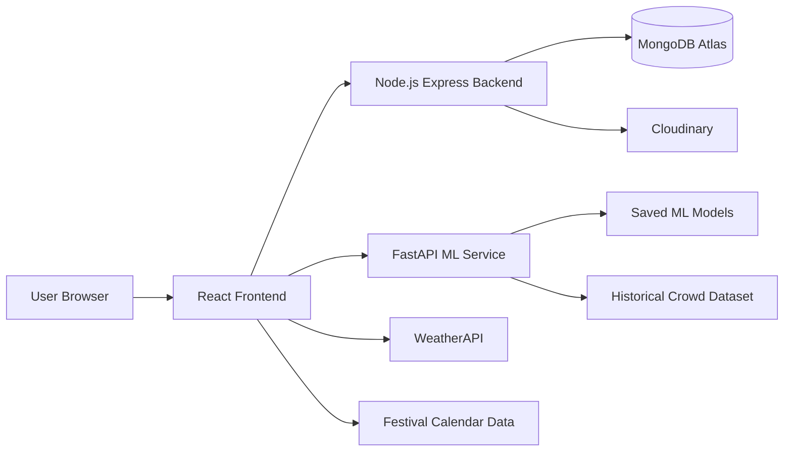

# SurakshaDarshan - Temple Crowd Management System

SurakshaDarshan is a full-stack temple crowd management platform built for the Smart India Hackathon. The application helps devotees search temples, view crowd predictions, reserve darshan slots, manage bookings, and generate QR-based passes. It also connects to a separate FastAPI ML service that predicts expected temple visitors using weather, festival, date, and historical crowd data.

## Live Links

- Website: [https://suraksha-darshan.onrender.com](https://suraksha-darshan.onrender.com)
- ML API Health Check: [https://suraksha-darshan-ml.onrender.com/health](https://suraksha-darshan-ml.onrender.com/health)
- Repository: [https://github.com/karankumarkhadria/SurakshaDarshan-](https://github.com/karankumarkhadria/SurakshaDarshan-)

Note: The project is deployed on Render free instances, so the first request can take some time if the services were sleeping. The frontend includes a warm-up request and retry handling for the ML service.

## Key Features

- Temple discovery with search, state filter, district filter, temple images, location, tags, history, and crowd status.
- AI-powered crowd prediction using date, weather, festival, public holiday, weekend, and historical visitor data.
- Online darshan slot booking with 15 daily time slots per temple.
- Live seat availability with booked-seat and available-seat updates.
- Transaction-safe booking and cancellation using MongoDB sessions.
- User login/signup with JWT authentication and bcrypt password hashing.
- Group booking flow with visitor details, Aadhaar validation, and visitor categories.
- QR-based booking pass generation with download and print support.
- Booking history separated into current, previous, and cancelled bookings.
- Parking availability flow with zones, vehicle types, availability status, and slot layout view.
- Temple map page with directions support.
- Admin panel for temple map upload and temple operations.
- Multilingual UI support.
- Render deployment with environment-based configuration for frontend, backend, and ML API.

## Tech Stack

### Frontend

- React
- Vite
- React Router
- Axios
- Tailwind CSS
- React QR Code

### Backend

- Node.js
- Express.js
- MongoDB
- Mongoose
- JWT
- bcrypt
- Multer
- Cloudinary

### ML Service

- Python
- FastAPI
- Uvicorn
- Pandas
- NumPy
- scikit-learn
- CatBoost
- LightGBM
- Joblib

### External Services

- MongoDB Atlas
- Render
- WeatherAPI
- Cloudinary

## Project Architecture



## Folder Structure

```text
SurakshaDarshan__/
├── Backend/
│   ├── src/
│   │   ├── controllers/
│   │   ├── db/
│   │   ├── middlewares/
│   │   ├── models/
│   │   ├── routes/
│   │   ├── scripts/
│   │   └── utils/
│   ├── package.json
│   └── .env.example
├── Frontend/
│   ├── src/
│   │   ├── components/
│   │   ├── config/
│   │   ├── context/
│   │   ├── data/
│   │   ├── hooks/
│   │   ├── i18n/
│   │   └── pages/
│   ├── package.json
│   └── .env.example
├── ML/
│   ├── models/
│   ├── app.py
│   ├── requirements-api.txt
│   └── .env.example
└── README.md
```

## How It Works

1. The user selects a temple from the React frontend.
2. The user chooses a visit date on the slot page.
3. The frontend fetches weather and festival/calendar information for that date.
4. The frontend sends prediction input to the FastAPI ML service.
5. The ML service returns the expected visitor count.
6. The frontend uses the predicted crowd to show slot capacity and availability.
7. The user selects a darshan slot and enters visitor details.
8. The backend stores the booking and updates slot availability inside a MongoDB transaction.
9. The confirmation page generates a QR pass for the booking.
10. The user can later view current, previous, and cancelled bookings.

## Local Setup

### Prerequisites

Install these before running the project:

- Node.js 18 or later
- npm 9 or later
- Python 3.11 or later
- MongoDB Atlas account or local MongoDB
- WeatherAPI key
- Cloudinary account, only required for admin map upload

## 1. Clone the Repository

```bash
git clone https://github.com/karankumarkhadria/SurakshaDarshan-.git
cd SurakshaDarshan-
```

If your folder name is different, open the folder that contains `Frontend`, `Backend`, and `ML`.

## 2. Backend Setup

Open a terminal:

```bash
cd Backend
npm install
```

Create a `.env` file inside `Backend` by copying `.env.example`.

```bash
copy .env.example .env
```

Fill these important values:

```env
PORT=8000
NODE_ENV=development
CORS_ORIGIN=http://localhost:5173,http://127.0.0.1:5173

MONGODB_URI=mongodb+srv://<username>:<password>@<cluster-host>

ACCESS_TOKEN_SECRET=your-access-token-secret
ACCESS_TOKEN_EXPIRY=1d
REFRESH_TOKEN_SECRET=your-refresh-token-secret
REFRESH_TOKEN_EXPIRY=7d

CLOUDINARY_CLOUD_NAME=your-cloudinary-cloud-name
CLOUDINARY_API_KEY=your-cloudinary-api-key
CLOUDINARY_API_SECRET=your-cloudinary-api-secret
```

Start the backend:

```bash
npm run dev
```

Backend will run on:

```text
http://localhost:8000
```

Health check:

```text
http://localhost:8000/api/v1/health
```

Optional admin seed:

```bash
npm run seed:admin
```

## 3. ML Service Setup

Open a second terminal:

```bash
cd ML
py -m venv .venv
.\.venv\Scripts\activate
python -m pip install --upgrade pip
python -m pip install -r requirements-api.txt
```

Create a `.env` file inside `ML` if needed.

```bash
copy .env.example .env
```

For local development:

```env
CORS_ORIGIN=http://localhost:5173,http://127.0.0.1:5173
```

Start the ML API:

```bash
python -m uvicorn app:app --host 0.0.0.0 --port 8001 --reload
```

ML service will run on:

```text
http://localhost:8001
```

Health check:

```text
http://localhost:8001/health
```

Expected response:

```json
{
  "status": "healthy",
  "rows_hist": 3653
}
```

## 4. Frontend Setup

Open a third terminal:

```bash
cd Frontend
npm install
```

Create a `.env` file inside `Frontend` by copying `.env.example`.

```bash
copy .env.example .env
```

Fill these values:

```env
VITE_API_BASE_URL=http://localhost:8000
VITE_ML_API_URL=http://localhost:8001
VITE_WEATHER_API_KEY=your-weather-api-key
```

Start the frontend:

```bash
npm run dev
```

Frontend will run on:

```text
http://localhost:5173
```

## Recommended Local Start Order

Run the services in this order:

1. ML service on port `8001`
2. Backend on port `8000`
3. Frontend on port `5173`

## Important API Routes

### User APIs

| Method | Route | Description |
| --- | --- | --- |
| POST | `/api/v1/users/register` | Register user |
| POST | `/api/v1/users/login` | Login user |
| GET | `/api/v1/users/me` | Get current logged-in user |
| POST | `/api/v1/users/logout` | Logout user |
| POST | `/api/v1/users/reset-password` | Reset password |

### Booking APIs

| Method | Route | Description |
| --- | --- | --- |
| POST | `/api/v1/bookings/booking` | Create booking |
| GET | `/api/v1/bookings/booking-history` | Fetch booking history |
| POST | `/api/v1/bookings/cancel-booking` | Cancel booking |
| GET | `/api/v1/bookings/slot-availability` | Get slot availability |
| POST | `/api/v1/bookings/initialize-slots` | Initialize slots |

### Admin APIs

| Method | Route | Description |
| --- | --- | --- |
| POST | `/api/v1/admin/login` | Admin login |
| POST | `/api/v1/admin/logout` | Admin logout |
| POST | `/api/v1/admin/upload-map` | Upload temple map |
| GET | `/api/v1/admin/get-map/:temple_id` | Get uploaded temple map |

### ML APIs

| Method | Route | Description |
| --- | --- | --- |
| GET | `/health` | ML health check |
| POST | `/predict` | Predict expected visitors |

## Sample ML Prediction Payload

```json
{
  "date": "2026-07-21",
  "temperature": 32.5,
  "precipitation": 4.2,
  "festival": "None",
  "temple_name": "Vaishno Devi Temple",
  "day_of_week": 1,
  "is_weekend": 0,
  "festival_flag": 0,
  "public_holiday": 0
}
```

Sample response:

```json
{
  "status": "success",
  "predicted_visitors": 43115,
  "date": "2026-07-21"
}
```

## Deployment Notes

The project is deployed on Render using separate services:

1. Main website service: Node.js backend serving the React build.
2. ML service: FastAPI app running with Uvicorn.

Main website Render environment variables:

```env
NODE_ENV=production
MONGODB_URI=your-mongodb-atlas-uri
CORS_ORIGIN=https://suraksha-darshan.onrender.com
VITE_API_BASE_URL=https://suraksha-darshan.onrender.com
VITE_ML_API_URL=https://suraksha-darshan-ml.onrender.com
VITE_WEATHER_API_KEY=your-weather-api-key
ACCESS_TOKEN_SECRET=your-access-token-secret
REFRESH_TOKEN_SECRET=your-refresh-token-secret
```

ML Render environment variables:

```env
CORS_ORIGIN=https://suraksha-darshan.onrender.com
```

Render free services can sleep after inactivity. To reduce waiting, the frontend warms up the ML service by calling `/health` when the app loads and retries `/predict` during cold starts.

## My Contribution

- Built and connected the main web flow from temple search to slot booking and QR confirmation.
- Developed React pages, routing, global booking context, protected booking flow, and booking history UI.
- Integrated backend APIs for authentication, booking, cancellation, and slot availability.
- Connected the React frontend with the FastAPI ML prediction service.
- Fixed deployment issues around CORS, environment variables, cookies, Render service URLs, and ML cold starts.
- Added production deployment support for serving the React build through the Express backend.

## Interview Talking Points

- Why separate ML service and web backend were used.
- How JWT authentication and cookies are handled.
- How MongoDB sessions help prevent overbooking.
- How slot capacity changes based on predicted visitors.
- How booking cancellation releases seats back to the slot.
- How Render deployment works for frontend, backend, and ML services.
- How cold starts were handled using frontend ML warm-up and retry logic.

## Future Improvements

- Add real-time admin analytics for crowd and booking trends.
- Add payment gateway support for special darshan or parking.
- Improve admin dashboard with booking management and reports.
- Add SMS/email notifications for booking confirmation and cancellation.
- Add live camera or sensor-based crowd updates if hardware data is available.

## Author

Karan Kumar Khadria

- GitHub: [karankumarkhadria](https://github.com/karankumarkhadria)
- Project Demo: [SurakshaDarshan](https://suraksha-darshan.onrender.com)
